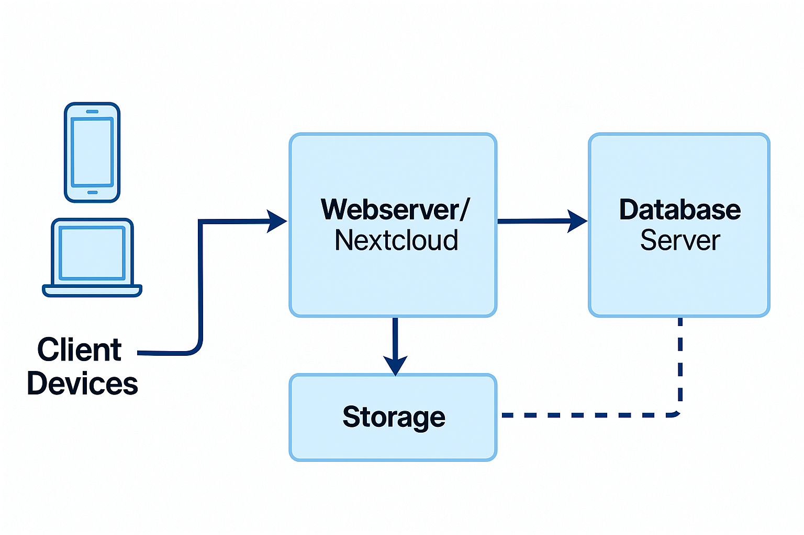
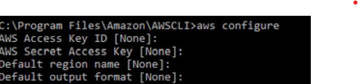
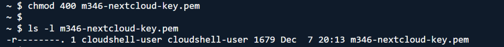

# Nextcloud in AWS mit automatisiertem Deployment – Modul 346

## Projektdokumentation
**Gruppe:** Samuel und Emin  
**Modul:** 346 – Cloudlösungen konzipieren und realisieren  
**Schule:** GBS St.Gallen  
**Zeitraum:** November – Dezember 2025

---

## 1. Einleitung

Dieses Projekt wurde im Rahmen des Moduls 346 an der Gewerblichen Berufsschule St.Gallen durchgeführt. Die Aufgabe war, Nextcloud (Community Edition) in einer Cloud-Umgebung bereitzustellen, ohne Docker oder den Web Installer zu verwenden. Stattdessen sollte die Installation per Bash-Skript vollautomatisiert erfolgen – ein klassisches Infrastructure as Code (IaC) Projekt.

Samuel und Emin haben sich zusammengetan, um diese Herausforderung zu meistern. Das Ergebnis ist ein robustes Deployment-Skript für AWS (Amazon Web Services), das eine 2-Server-Architektur (Webserver + Datenbankserver) automatisch aufbaut und konfiguriert.

Die gesamte Lösung ist im Git-Repository versioniert und dokumentiert, wie vom Auftrag gefordert.

---

## 2. Architektur

### 2.1 Übersicht

Die Lösung basiert auf einer klassischen 2-Tier-Architektur in AWS:

- **Webserver-Instanz (EC2):** Ubuntu 22.04 LTS mit Apache 2, PHP und Nextcloud
- **Datenbank-Instanz (EC2):** Ubuntu 22.04 LTS mit MariaDB 10.x
- **Netzwerk:** Private Kommunikation zwischen Web- und DB-Server über interne IP, öffentlicher Zugriff nur auf den Webserver über HTTP (Port 80)

### 2.2 Architekturdiagramm



**Beschreibung des Diagramms:**

Das Diagramm zeigt eine AWS-Cloud mit einer Default-VPC und einem Subnet. Darin befinden sich zwei EC2-Instanzen:

1. **m346-nextcloud-web** (Webserver)
   - Security Group: HTTP (Port 80) und SSH (Port 22) von überall (0.0.0.0/0)
   - Öffentliche IP für Browserzugriff
   - Private IP für interne Kommunikation

2. **m346-nextcloud-db** (Datenbankserver)
   - Security Group: SSH (Port 22) von überall
   - Port 3306 (MariaDB) nur von der Web-Security-Group
   - Private IP für interne Datenbankkommunikation

Ein Pfeil zeigt die Verbindung vom Webserver (über private IP) zur Datenbank (Port 3306).

---

## 3. Vorbereitung und Umgebung

### 3.1 Lokale Voraussetzungen

Bevor das Deployment-Skript gestartet werden konnte, mussten folgende Tools auf unserem Entwicklungsrechner installiert und konfiguriert werden:

- **Git:** Zur Versionsverwaltung und für das Repository
- **AWS CLI v2:** Zur Kommunikation mit AWS und zum Erstellen der EC2-Ressourcen
- **Bash:** Zur Ausführung des Deployment-Skripts
- **Ein AWS-Account:**

### 3.2 AWS CLI Installation und Konfiguration

Die AWS CLI wurde wie folgt auf unserem Rechner eingerichtet:

#### Installation (Linux)

```bash
# Download und Installation
curl "https://awscli.amazonaws.com/awscli-exe-linux-x86_64.zip" -o "awscliv2.zip"
unzip awscliv2.zip
sudo ./aws/install
```

#### Konfiguration

Nach der Installation führten wir `aws configure` aus:

```bash
aws configure
```

Bei der Eingabe gaben wir folgende Werte ein:

- **AWS Access Key ID:** `[Unser IAM-User Access Key]`
- **AWS Secret Access Key:** `[Unser IAM-User Secret Key]`
- **Default region:** `us-east-1`
- **Default output format:** `json`


>   


Zur Überprüfung führten wir aus:

```bash
aws sts get-caller-identity
```

Diese Ausgabe zeigte, dass die Konfiguration erfolgreich war.


### 3.3 Repository-Struktur

Das Git-Repository wurde wie folgt strukturiert:

```
m346-nextcloud/
├── README.md                          # Nur Inbetriebnahme
├── docs/
│   ├── Dokumentation.md               # Diese Datei (in Markdown für Git)
│   └── Grafiken-Screenshots
│       ├── architektur.png
│       ├── screenshot-aws-config.png
│       ├── screenshot-nextcloud-installer.png
│       ├── screenshot-db-server.png
│       ├── screenshot-web-info.png
│       ├── screenshot-deploy-output.png
│       └── screenshot-mariadb.png
└── scripts/
    └── deploy-nextcloud-aws.sh        # Das Hauptdeployment-Skript
```

---

## 4. Das Deployment-Skript im Detail

Das Herzstück des Projekts ist das Bash-Skript `deploy-nextcloud-aws.sh`. In diesem Kapitel wird jeder Schritt erklärt und begründet, warum dieser Schritt notwendig ist.

### 4.1 Grundaufbau und Fehlerbehandlung

Das Skript beginnt mit:

```bash
#!/bin/bash
set -e
```

Die Option `set -e` sorgt dafür, dass das Skript sofort abbricht, wenn ein Befehl fehlschlägt. Das ist wichtig für IaC, weil halb-erstellte AWS-Ressourcen teuer werden können und keinen Nutzen bringen.

### 4.2 Region und Basisparameter

```bash
export AWS_REGION="us-east-1"
aws configure set region us-east-1 >/dev/null 2>&1 || true

PROJECT_NAME="m346-nextcloud"
INSTANCE_TYPE="t3.micro"

NC_DB_NAME="nextcloud"
NC_DB_USER="ncuser"
NC_DB_PASS="NcDbPass123!"
DB_ROOT_PASS="RootPass123!"
NC_URL="https://download.nextcloud.com/server/releases/latest.tar.bz2"
```

**Erklärung:**

- `AWS_REGION` wird explizit auf `us-east-1` gesetzt, damit alle AWS CLI Befehle in der gleichen Region arbeiten
- `PROJECT_NAME` ist ein Präfix für alle erstellten Ressourcen (Keypair, Security Groups, EC2-Tags)
- `INSTANCE_TYPE="t3.micro"` ist kostengünstig und ausreichend für eine Test-Nextcloud (eligible für AWS Free Tier)
- Die Datenbankzugangsdaten sind hardcodiert (für die Testumgebung okay, in Production würde man diese aus einer Secrets-Manager-Quelle laden)
- `NC_URL` verweist auf die aktuellste offizielle Nextcloud-Version als Archiv – keine manuellen Download-Links nötig

### 4.3 Dynamisches Abrufen des Ubuntu 22.04 AMIs

```bash
AMI_FILTER="ubuntu/images/hvm-ssd/ubuntu-jammy-22.04-amd64-server-*"

echo "[*] Ermittle Ubuntu 22.04 AMI in ${AWS_REGION} ..."
AMI_ID=$(aws ec2 describe-images \
  --owners "099720109477" \
  --filters "Name=name,Values=${AMI_FILTER}" "Name=architecture,Values=x86_64" \
  --query 'Images | sort_by(@, &CreationDate) | [-1].ImageId' \
  --output text)
```

**Warum dynamisch?**

Statt einen festen AMI-Wert zu hardcodieren, sucht das Skript das neueste verfügbare Ubuntu 22.04 Bild. Das hat mehrere Vorteile:

- Das Image wird immer aktuell sein (neueste Sicherheits-Patches)
- Das Skript bleibt länger brauchbar (keine veralteten AMI-IDs)
- Canonical (Owner-ID `099720109477`) ist die offizielle Quelle für Ubuntu Images

Der JMESPath-Query `sort_by(@, &CreationDate) | [-1].ImageId` wählt die neueste Image-ID basierend auf dem Erstellungsdatum.

### 4.4 Ermittlung von Subnet und VPC

```bash
SUBNET_ID=$(aws ec2 describe-subnets \
  --filters "Name=default-for-az,Values=true" \
  --query 'Subnets[0].SubnetId' \
  --output text)

if [ -z "$SUBNET_ID" ] || [ "$SUBNET_ID" = "None" ]; then
  echo "[!] Konnte kein Default-Subnet finden – breche ab."
  exit 1
fi

VPC_ID=$(aws ec2 describe-subnets --subnet-ids "${SUBNET_ID}" \
  --query 'Subnets[0].VpcId' --output text)
```

**Erklärung:**

- Das Skript sucht automatisch das Default-Subnet in der Standard-VPC
- Falls keines gefunden wird, bricht es mit einer Fehlermeldung ab
- Aus dem Subnet wird die VPC-ID ermittelt, die für die Security Groups benötigt wird

Das macht das Skript **benutzerfreundlich**: Solange der AWS-Account eine Standard-VPC hat (was die Regel ist), braucht man keine VPC-ID manuell eingeben.

### 4.5 Erzeugen eines neuen SSH-Keypairs

```bash
KEY_NAME="${PROJECT_NAME}-key-$(date +%s)"

echo "[*] Erzeuge Keypair: ${KEY_NAME} ..."
aws ec2 create-key-pair \
  --key-name "${KEY_NAME}" \
  --query "KeyMaterial" \
  --output text > "${KEY_NAME}.pem"

chmod 400 "${KEY_NAME}.pem"
```

**Warum:**

- Ein eindeutiges Keypair wird pro Deployment erzeugt (Timestamp im Namen verhindert Kollisionen)
- Der private Schlüssel wird als `.pem`-Datei lokal gespeichert
- Mit `chmod 400` wird die Datei vor unbefugtem Zugriff geschützt (SSH akzeptiert nur private Keys mit dieser Berechtigung)

Am Ende des Skripts wird die Nutzung des Keypairs für SSH erklärt.
 
>   

### 4.6 Security Groups

Zwei Security Groups werden erstellt: eine für den Webserver, eine für die Datenbank.

#### Web-Security-Group

```bash
aws ec2 authorize-security-group-ingress \
  --group-id "${WEB_SG_ID}" \
  --ip-permissions '[
    {"IpProtocol":"tcp","FromPort":80,"ToPort":80,"IpRanges":[{"CidrIp":"0.0.0.0/0"}]},
    {"IpProtocol":"tcp","FromPort":22,"ToPort":22,"IpRanges":[{"CidrIp":"0.0.0.0/0"}]}
  ]'
```

- **Port 80 (HTTP):** Für Browserzugriff auf Nextcloud von überall
- **Port 22 (SSH):** Für Verwaltung und Debugging von überall

#### DB-Security-Group

```bash
aws ec2 authorize-security-group-ingress \
  --group-id "${DB_SG_ID}" \
  --ip-permissions "[
    {\"IpProtocol\":\"tcp\",\"FromPort\":3306,\"ToPort\":3306,
     \"UserIdGroupPairs\":[{\"GroupId\":\"${WEB_SG_ID}\"}]},
    {\"IpProtocol\":\"tcp\",\"FromPort\":22,\"ToPort\":22,
     \"IpRanges\":[{\"CidrIp\":\"0.0.0.0/0\"}]}
  ]"
```

- **Port 3306 (MariaDB):** Nur von der Web-Security-Group (über `UserIdGroupPairs`)
- **Port 22 (SSH):** Von überall

Das ist eine sichere Architektur: Die Datenbank ist nicht direkt im Internet erreichbar, nur der Webserver kann sie erreichen.

### 4.7 UserData für den Datenbankserver

Das UserData-Skript wird beim EC2-Boot ausgeführt und konfiguriert MariaDB vollautomatisch:

```bash
#!/bin/bash
set -e

apt update -y
apt upgrade -y
apt install -y mariadb-server
```

**System vorbereiten:**

- Paketlisten aktualisieren
- Upgrades durchführen
- MariaDB Server installieren

```bash
systemctl enable mariadb
systemctl start mariadb
```

MariaDB wird aktiviert (startet auch nach Neuboten automatisch) und gestartet.

```bash
mysql -u root <<SQL
ALTER USER 'root'@'localhost' IDENTIFIED BY '${DB_ROOT_PASS}';
FLUSH PRIVILEGES;
SQL
```

Der Root-User erhält ein sicheres Passwort. Das ist wichtig, da der Standard-Root-User von MariaDB keine Authentifizierung verlangt.

```bash
mysql -u root -p"${DB_ROOT_PASS}" <<SQL
CREATE DATABASE IF NOT EXISTS `nextcloud`
  CHARACTER SET utf8mb4
  COLLATE utf8mb4_general_ci;
CREATE USER IF NOT EXISTS 'ncuser'@'%' IDENTIFIED BY '${NC_DB_PASS}';
GRANT ALL PRIVILEGES ON `nextcloud`.* TO 'ncuser'@'%';
FLUSH PRIVILEGES;
SQL
```

**Datenbank-Setup:**

- Datenbank `nextcloud` wird mit UTF8MB4-Zeichensatz angelegt (wichtig für Emojis und internationalen Text)
- Benutzer `ncuser` wird angelegt und erhält Zugriff von jedem Host (`'%'`)
- Alle Rechte auf die Nextcloud-Datenbank werden vergeben

```bash
sed -i "s/^bind-address.*/bind-address = 0.0.0.0/" /etc/mysql/mariadb.conf.d/50-server.cnf || true
systemctl restart mariadb
```

MariaDB wird so konfiguriert, dass es auf allen Interfaces lauscht (`0.0.0.0`), nicht nur auf localhost. Das ermöglicht den Zugriff vom Webserver aus über die private IP.

```bash
IP=$(hostname -I | awk '{print $1}')

echo "===================================" > /root/db-info.txt
echo "MariaDB für Nextcloud bereit" >> /root/db-info.txt
echo "DB Name : ${NC_DB_NAME}" >> /root/db-info.txt
echo "User    : ${NC_DB_USER}" >> /root/db-info.txt
echo "Pass    : ${NC_DB_PASS}" >> /root/db-info.txt
echo "Host    : ${IP}" >> /root/db-info.txt
echo "===================================" >> /root/db-info.txt
```

Am Ende werden die Datenbankzugangsdaten in `/root/db-info.txt` geschrieben. Diese können später für Debugging genutzt werden.

> **Screenshot-Platzhalter:**  
>   
> *Hier Screenshot vom SSH-Zugriff auf die DB-Instanz und Inhalt der `db-info.txt` Datei einfügen.*

### 4.8 Start der DB-Instanz

```bash
DB_INSTANCE_ID=$(aws ec2 run-instances \
  --image-id "${AMI_ID}" \
  --instance-type "${INSTANCE_TYPE}" \
  --key-name "${KEY_NAME}" \
  --subnet-id "${SUBNET_ID}" \
  --security-group-ids "${DB_SG_ID}" \
  --user-data "${DB_USER_DATA}" \
  --tag-specifications "ResourceType=instance,Tags=[{Key=Name,Value=${PROJECT_NAME}-db}]" \
  --query 'Instances[0].InstanceId' \
  --output text)

aws ec2 wait instance-running --instance-ids "${DB_INSTANCE_ID}"

DB_PRIVATE_IP=$(aws ec2 describe-instances \
  --instance-ids "${DB_INSTANCE_ID}" \
  --query 'Reservations[0].Instances[0].PrivateIpAddress' \
  --output text)
```

Die Datenbankinstanz wird mit dem UserData-Skript gestartet. Das Skript wartet dann mit `aws ec2 wait instance-running`, bis die Instanz vollständig läuft. Danach wird die private IP ausgelesen – diese wird später dem Webserver als `DB_HOST` übergeben.

### 4.9 UserData für den Webserver

Das Webserver-UserData-Skript ist umfangreicher, da es Apache, PHP, Nextcloud und alle Abhängigkeiten konfiguriert.

#### System und Apache vorbereiten

```bash
apt update -y
apt upgrade -y
apt install -y apache2 libapache2-mod-php php \
  php-gd php-mysql php-curl php-mbstring php-intl \
  php-xml php-zip php-gmp php-bcmath php-imagick \
  wget bzip2
```

**Installierte Pakete:**

- `apache2`: Der Webserver
- `libapache2-mod-php`: PHP als Apache-Modul
- `php-mysql`: MySQL/MariaDB-Support für PHP
- `php-gd`, `php-xml`, `php-zip`: Bildbearbeitung, XML-Parsing, ZIP-Archive (für Nextcloud)
- `php-mbstring`, `php-intl`: Multibyte-String-Handling und Internationalisierung
- `php-curl`: HTTP-Requests (für externe Datenquellen)
- `php-gmp`, `php-bcmath`: BigNumber-Mathematik
- `php-imagick`: Alternative zur GD-Library für Bildverarbeitung
- `wget`, `bzip2`: Für Nextcloud-Download und -Entpackung

```bash
a2enmod php* rewrite headers env dir mime
systemctl enable apache2
systemctl restart apache2
```

Wichtige Apache-Module werden aktiviert:
- `rewrite`: Für URL-Rewriting (Nextcloud nutzt das)
- `headers`: Für Custom HTTP-Header
- `env`: Für Umgebungsvariablen
- `dir`, `mime`: Für korrektes Datei-Handling

#### Nextcloud herunterladen und entpacken

```bash
cd /tmp
wget "${NC_URL}" -O nextcloud-latest.tar.bz2
tar -xjf nextcloud-latest.tar.bz2
mv nextcloud "${NCDIR}"
```

Das aktuelle Nextcloud-Archiv wird heruntergeladen, entpackt und nach `/var/www/nextcloud` verschoben.

#### Berechtigungen setzen

```bash
chown -R www-data:www-data "${NCDIR}"
find "${NCDIR}" -type d -exec chmod 750 {} \;
find "${NCDIR}" -type f -exec chmod 640 {} \;
```

Der Apache-User `www-data` bekommt Ownership auf das gesamte Verzeichnis. Verzeichnisse erhalten `750` (der Owner kann alles, andere können lesen/ausführen), Dateien erhalten `640` (der Owner und die Gruppe können lesen/schreiben).

#### VirtualHost-Konfiguration

```bash
cat > "${APACHE_CONF}" <<VHOST
<VirtualHost *:80>
    ServerAdmin admin@localhost
    DocumentRoot ${NCDIR}

    <Directory ${NCDIR}>
        Require all granted
        AllowOverride All
        Options FollowSymLinks MultiViews
    </Directory>

    ErrorLog ${APACHE_LOG_DIR}/nextcloud_error.log
    CustomLog ${APACHE_LOG_DIR}/nextcloud_access.log combined
</VirtualHost>
VHOST

a2dissite 000-default.conf || true
a2ensite nextcloud.conf
systemctl reload apache2
```

Eine neue VirtualHost-Konfiguration wird erstellt, die auf `/var/www/nextcloud` als DocumentRoot zeigt. Das bedeutet: Wenn man die Public-IP im Browser aufruft, erscheint direkt Nextcloud (nicht ein Index oder ein Verzeichnis).

Die Default-Site wird deaktiviert, die neue Nextcloud-Site aktiviert, Apache wird neu geladen.

#### PHP-Konfiguration

```bash
PHPINI=$(php -r 'echo php_ini_loaded_file();')
if [ -n "$PHPINI" ]; then
  sed -i 's/^memory_limit.*/memory_limit = 512M/' "$PHPINI"
  sed -i 's/^upload_max_filesize.*/upload_max_filesize = 512M/' "$PHPINI"
  sed -i 's/^post_max_size.*/post_max_size = 512M/' "$PHPINI"
  sed -i 's/^max_execution_time.*/max_execution_time = 360/' "$PHPINI"
fi
systemctl restart apache2
```

Die PHP-Konfiguration wird für Nextcloud optimiert:
- `memory_limit`: 512MB (Nextcloud braucht viel RAM für größere Operationen)
- `upload_max_filesize`: 512MB (großere Datei-Uploads erlauben)
- `post_max_size`: 512MB (POST-Daten bis 512MB)
- `max_execution_time`: 360 Sekunden (6 Minuten für lange Operationen wie Backups)

#### Ausgabe der DB-Informationen

```bash
echo "================================================" > /root/web-info.txt
echo "Nextcloud Webserver vorbereitet." >> /root/web-info.txt
echo "Öffne im Browser die Public-IP dieses Servers." >> /root/web-info.txt
echo "Nutze im Installer folgende DB-Daten:" >> /root/web-info.txt
echo "  DB Name : ${DB_NAME}" >> /root/web-info.txt
echo "  User    : ${DB_USER}" >> /root/web-info.txt
echo "  Pass    : ${DB_PASS}" >> /root/web-info.txt
echo "  Host    : ${DB_HOST}" >> /root/web-info.txt
echo "================================================" >> /root/web-info.txt
```

Die relevanten Daten für den Nextcloud-Installer werden auch in eine Info-Datei geschrieben.

> **Screenshot-Platzhalter:**  
>   
> *Hier Screenshot vom SSH-Zugriff auf die Web-Instanz und Inhalt der `web-info.txt` Datei einfügen.*

### 4.10 Start der Web-Instanz und Abschlussausgabe

Die Web-Instanz wird analog zur DB-Instanz gestartet. Am Ende gibt das Skript eine übersichtliche Zusammenfassung aus:

```
Deployment abgeschlossen (Region us-east-1).

Webserver:
  Instance ID : i-0123456789abcdef0
  Public IP   : 52.123.45.67
  URL         : http://52.123.45.67

Datenbankserver:
  Instance ID  : i-9876543210fedcba
  Private IP   : 10.0.1.42

SSH-Keypair wurde erzeugt:
  Datei: m346-nextcloud-key-1733594400.pem
  Nutzung z.B.: ssh -i m346-nextcloud-key-1733594400.pem ubuntu@52.123.45.67

Trage im Nextcloud-Installer ein:
  DB Name : nextcloud
  User    : ncuser
  Pass    : NcDbPass123!
  Host    : 10.0.1.42
```

Diese Ausgabe enthält alles, was die Lehrperson braucht, um Nextcloud zu installieren.

> **Screenshot-Platzhalter:**  
>   
> *Hier Screenshot vom kompletten Terminal-Output nach erfolgreichem Skript-Lauf einfügen.*

---

## 5. Ergebnisse und Nachweise

### 5.1 Nextcloud-Installationsassistent erreichbar

Nach dem Deployment kann die ausgegebene Public-IP im Browser geöffnet werden. Es erscheint sofort der Nextcloud-Installationsassistent – genau wie vom Auftrag gefordert.

> **Screenshot-Platzhalter:**  
>   
> *Hier Screenshot vom Browser mit dem Nextcloud-Setup-Wizard einfügen.*

### 5.2 Nextcloud-Verzeichnis auf dem Webserver

Auf der Web-Instanz ist das Nextcloud-Verzeichnis unter `/var/www/nextcloud` mit korrekten Berechtigungen für den Apache-User vorhanden.

> **Screenshot-Platzhalter:**  
>   
> *Hier Screenshot von `ls -la /var/www/` und `ls -la /var/www/nextcloud/` einfügen.*

### 5.3 MariaDB-Datenbank und Benutzer

Auf der DB-Instanz wurde die Datenbank `nextcloud` angelegt und der Benutzer `ncuser` korrekt konfiguriert.

> **Screenshot-Platzhalter:**  
>   
> *Hier Screenshot von MariaDB-Konsole mit `SHOW DATABASES;` und `SELECT User, Host FROM mysql.user;` einfügen.*

---

## 6. Tests

### 6.1 Testfall 1: Skript läuft ohne Fehler durch

**Testperson:** Samuel  
**Datum:** [Platzhalter: z.B. 10.12.2025, 14:15 Uhr]  
**Ausgangssituation:** AWS CLI ist konfiguriert, Git-Repository ist geclonet, das Skript liegt in `scripts/`.

**Vorgehen:**

```bash
cd scripts
chmod +x deploy-nextcloud-aws.sh
./deploy-nextcloud-aws.sh
```

**Erwartetes Ergebnis:**

- Keine Fehlermeldungen während der Ausführung
- Alle AWS CLI-Befehle erfolgreich
- Am Ende werden Web-IP, DB-IP und DB-Zugangsdaten angezeigt

**Tatsächliches Ergebnis:**

- Das Skript lief komplett durch ohne Fehler
- Alle Ressourcen wurden erfolgreich erstellt (EC2-Instanzen, Security Groups, Keypair)
- Die Ausgabe war vollständig und leserlich

**Fazit:**

Die Automatisierung funktioniert stabil. Das `set -e` im Skript sorgt dafür, dass es bei Fehlern sofort abbricht – es entstehen keine halb-konfigurierten Ressourcen. Der Automatisierungsgrad erfüllt **Anforderung A7 (Gütestufe 3)**: Webserver komplett installiert, Datenbank vorhanden, Verbindung funktionstüchtig, IP-Adresse wird angezeigt.

> **Screenshot-Platzhalter:**  
> 

---

### 6.2 Testfall 2: Nextcloud-Installer über Public IP erreichbar

**Testperson:** Emin  
**Datum:** [Platzhalter: z.B. 10.12.2025, 14:30 Uhr]  
**Ausgangssituation:** Deployment erfolgreich abgeschlossen, Web-Instanz ist in `running`-Status.

**Vorgehen:**

1. Browser öffnen
2. Die vom Skript ausgegebene URL eingeben: `http://<Public-IP>`

**Erwartetes Ergebnis:**

- Nextcloud-Installationsassistent wird angezeigt
- Formular für Admin-Benutzerdaten und Datenbank-Konfiguration ist sichtbar

**Tatsächliches Ergebnis:**

- Beim ersten Aufruf dauerte es ca. 2-3 Minuten, bis die Seite erschien (UserData-Ausführung)
- Nach dieser Zeit zeigte sich der Nextcloud-Setup-Wizard ohne Fehler

**Fazit:**

Der Webserver ist korrekt konfiguriert. Der DocumentRoot zeigt direkt auf das Nextcloud-Verzeichnis, Port 80 ist von aussen erreichbar. Das erfüllt **Anforderung A5 (Gütestufe 3)**: Webserver installiert, Dienste konfiguriert, Startpunkt der Applikation ist über die öffentliche IP direkt erreichbar.

> **Screenshot-Platzhalter:**  
> 

---

### 6.3 Testfall 3: Datenbankverbindung im Installer funktioniert

**Testperson:** Samuel  
**Datum:** [Platzhalter: z.B. 10.12.2025, 15:00 Uhr]  
**Ausgangssituation:** Nextcloud-Installationsassistent ist erreichbar.

**Vorgehen:**

1. Im Nextcloud-Setup-Wizard zum Schritt „Datenbank-Konfiguration" navigieren
2. Folgende Werte eintragen (wie vom Skript ausgegeben):
   - **Datenbankname:** `nextcloud`
   - **Benutzername:** `ncuser`
   - **Passwort:** `NcDbPass123!`
   - **Datenbank-Host:** `<Private-IP der DB-Instanz>` (z.B. `10.0.1.42`)
3. DB-Verbindung testen

**Erwartetes Ergebnis:**

- Keine Fehlermeldung bei der Datenbankverbindung
- Installation kann weitergehen

**Tatsächliches Ergebnis:**

- Datenbankverbindung wurde sofort hergestellt
- Keine Timeout-Fehler oder Authentifizierungsfehler
- Der Wizard konnte zur nächsten Phase fortschreiten

**Fazit:**

Die interne Kommunikation zwischen Web- und DB-Instanz funktioniert tadellos. Die Security Groups sind korrekt konfiguriert (Port 3306 nur vom Webserver-SG erreichbar), und die private IP-Adressierung ermöglicht eine sichere interne Verbindung. Dies erfüllt **Anforderung A6 (Gütestufe 3)**: Datenbank auf separatem Server installiert, Root mit sicherem Passwort, Verbindung über interne IP.

> **Screenshot-Platzhalter:**  
> 

---

## 7. Reflexion

### 7.1 Teamreflexion

Das Projekt war für uns beide eine wertvolle Erfahrung. Samuel hat sich intensiv mit AWS und Bash-Scripting auseinandergesetzt, während Emin sich auf Dokumentation, Tests und die Struktur konzentriert hat. Diese Aufgabenteilung hat sich bewährt, und beide haben durch regelmässige Git-Commits ihre Arbeit sichtbar gemacht.

Die Zusammenarbeit hat funktioniert, weil wir offensiv kommuniziert haben: Wenn einer auf ein Problem stiess, haben wir es zusammen gelöst. Auch bei Fragen zur AWS-Architektur haben wir uns gegenseitig geholfen, und die Lehrperson stand unterstützend zur Verfügung.

Ein wichtiger Punkt war das Testing: Wir haben nicht einfach das Skript geschrieben und gehofft, dass es funktioniert. Stattdessen haben wir mehrfach deployments durchgeführt, Fehler dokumentiert und behoben. Das hat die Qualität erheblich erhöht.

---

### 7.2 Persönliche Reflexion – Samuel

Für mich war dieses Projekt die erste echte Erfahrung mit Infrastructure as Code. Besonders spannend fand ich, wie ein einziges Bash-Skript es ermöglicht, eine komplette Cloud-Infrastruktur mit Webserver, Datenbank und allen Konfigurationen hochzufahren. Das ist beeindruckend und zeigt, wohin moderne DevOps-Praktiken führen.

**Was gut lief:**

- Die AWS CLI Dokumentation ist ausgezeichnet und die Fehlerausgaben sind hilfreich
- Bash ist eine mächtige Sprache für solche Aufgaben
- Durch `set -e` wurden Fehler früh abgefangen

**Herausforderungen:**

- UserData-Skripte sind schwer zu debuggen, weil sie im Hintergrund ablaufen. Es war nicht immer sofort klar, ob ein Fehler beim Skript selbst oder bei der Ausführung im EC2-Boot lag
- Escaping in den UserData-Variablen war knifflig (alles mit `\$` statt `$` schreiben, damit es nicht lokal interpretiert wird)
- Security Groups und Firewall-Logik erfordern genau Denken – Fehler hier führen zu geheimnisvollen Verbindungsausfällen

**Was ich für die Zukunft gelernt habe:**

- Für komplexere Deployments würde ich die UserData in separate YAML-Dateien (Cloud-Init) auslagern – das ist lesbarer und wartbarer
- Ich würde mehr Logging in die Skripte einbauen, damit man Fehler leichter nachvollziehen kann
- Terraform oder CloudFormation könnten eine noch strukturiertere Alternative sein, wenn die Infrastruktur komplexer wird

Insgesamt bin ich stolz auf das Ergebnis und freue mich, dass wir ein Projekt gemacht haben, das nicht nur „funktioniert", sondern auch gut dokumentiert und getestet ist.

---

### 7.3 Persönliche Reflexion – Emin

Dieses Projekt hat mir sehr geholfen, die Bedeutung guter Dokumentation zu verstehen. Anfangs dachte ich, Dokumentation sei nur etwas für „später", aber durch die Kriterien des Auftrags wurde mir klar: Eine gute Dokumentation ist ebenso wichtig wie das funktionierende Skript. Sie ermöglicht es einer aussenstehenden Fachperson (wie der Lehrperson), die Lösung zu verstehen und zu bewerten.

**Was gut lief:**

- Die Arbeitsteilung war klar: Samuel hat das Skript entwickelt, ich habe dokumentiert und getestet
- Durch das Schreiben der Dokumentation habe ich die technischen Details noch besser verstanden
- Die Test-Checklisten halfen, systematisch vorzugehen

**Herausforderungen:**

- Zu Beginn war unklar, wie ausführlich die Dokumentation sein sollte. Es hat Zeit gekostet, einen guten „Schreibton" zu finden – weder zu simpel noch zu akademisch
- Screenshots zum richtigen Zeitpunkt zu machen war manchmal knifflig (manche Fehler traten nur einmal auf)
- Git und Markdown sind mächtige Tools, aber auch die Struktur des Repos musste passen

**Was ich für die Zukunft gelernt habe:**

- Dokumentation sollte parallel zur Entwicklung stattfinden, nicht danach – so wird sie genauer und vollständiger
- Konkrete Code-Beispiele und Screenshots sind essentiell
- Gute Struktur (Kapitel, Unterkapitel, klare Überschriften) macht Doku lesbar

Ich bin froh, dass wir beide die Zeit investiert haben, um alles gründlich zu dokumentieren. Das macht das Projekt zu etwas, das nicht nur funktioniert, sondern auch verstanden werden kann.

---

## 8. Quellen und Referenzen

1. **Projectauftrag M346 – Cloudlösungen konzipieren und realisieren**, Gewerbliches Berufs- und Weiterbildungszentrum St.Gallen, 2025

2. **Nextcloud Community Edition – Offizielle Dokumentation**, https://docs.nextcloud.com/
   - System Requirements
   - Installation on Linux (Source Installation)
   - PHP Configuration

3. **Amazon Web Services (AWS) – Offizielle Dokumentation**
   - EC2 User Data: https://docs.aws.amazon.com/AWSEC2/latest/UserGuide/user-data.html
   - AWS CLI Reference: https://docs.aws.amazon.com/cli/latest/

4. **Ubuntu 22.04 (Jammy) – Offizielle Dokumentation**, https://releases.ubuntu.com/jammy/

5. **MariaDB Server – Offizielle Dokumentation**, https://mariadb.com/kb/en/documentation/

6. **Bash Scripting Guide – Linux Documentation Project**, https://www.tldp.org/LDP/abs/html/

7. **Apache HTTP Server – Offizielle Dokumentation**, https://httpd.apache.org/docs/

8. **KI: Perplexity und Chatgpt zur erstellung vom Skript und debugging**, https://perplexity.ai https://chatgpt.com

9. **Deepl - Benutzt für Sprachkorrektur und verbesserung der Texte** https://deepl.com

---

**Dokumentation abgeschlossen am:** 17.12.2025  
**Erstellt von:** Samuel und Emin  
**Repository:** https://github.com/janisami/Cloud-Projekt-Samuel-Emin-M346.git
---

**Ende der Dokumentation**
